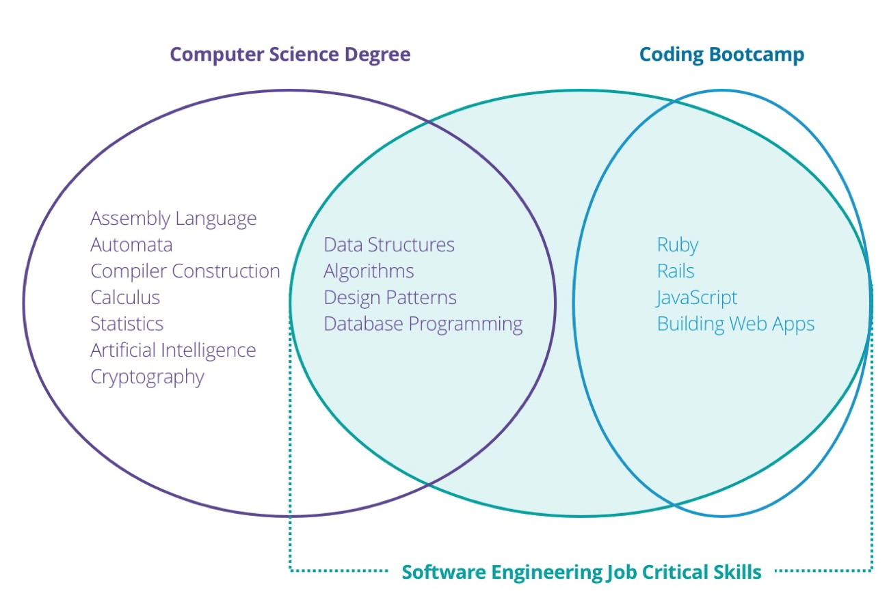

Computer Science is one of the most popular career path for students in this generation. Factors like the scope of it and the pay rate in the field excites many. The case is not different in Nepal and this has few problems. In this blog, I will try to provide my opinion and statistics about Computer Science in the context of Nepal.

I study Computer Science and Information Technology at Sagarmatha College of Science and Technology which is affiliated to Tribhuvan University. At the time of writing, I am in the 4th semester. 

## Computer Science
According to Wikipedia, Computer Science is the study of processes that interact with data and that can be represented as data in the form of programs. It enables the use of algorithms to manipulate, store, and communicate digital information.

Now as we have at least known what Computer Science is, it's really important to solve the misconception about what Computer Science is not. I found a great article by the Boston Univeristy which talks about what is computer science what is it not and many more. You can read the article <a href='https://www.cs.bu.edu/AboutCS/WhatIsCS.pdf' target='_blank'>here</a>. I am going to briefly write it here instead of copying everything. 

>So according to the Boston University, Computer Science is not just about building computers or writing computer programs like astronomy is not about building telescopes, biology about building microscopes or music about building musical instruments. Computer Science is not about the tools we use to solve a Computer Science problems. It is about when to use the tool to solve a particular problem. Computer Science problems don't even require Computers considering the fact that these problems were solved even before computers were built. So, Computer Science is about building computers, writing computer programs and _so much more_....

## Computer Science in Nepal
Nepal is a small country with 10 Universities in the entire country which I didn't even knew before the time of writing. I knew 4 of them and they are Tribhuvan University, Kathmandu University, Pokhara University and Purwanchal University. My unawareness might be because of the quality of them and could also mean that I am not interested in the course they provide like Nepal Sanskrit University which probably teaches the sanskrit language which I am not sure of and it's not the concern right now. Let's move on to discuss about the most popular computer science course in Nepal.

**Tribhuvan University** is the largest university of Nepal. It has affiliated colleges all over the country and hence the number of students enrolled in the univeristy is massive. In terms of no of student enrollment, TU is regarded as one of the top univerisities. I am aware of 4 courses TU provides in the field related to computers. They are Bachelor's of Science in Computer Science and Information Technology (B.Sc CSIT), Bachelor of Engineering in Computer (B.E. Computer), Bachelor of Arts in Computer Application (BCA), and Bachelor in Information Management (BIM). All these subjects deal with similar core subjects related to computers and differ in the additionals they provide like BIM, which deals with Computer and also the use of it in business. The focus of my blog would be about CSIT as it is their core Computer Science subject.

**B.Sc CSIT** is a 4 year (8 Semester) course. There are more than 50 colleges affiliated to the Tribhuvan university that teaches CSIT in Nepal. **CSIT is a research oriented course that focuses more on thoretical computations, design and analysis of algorithms etc and keeps development/engineering of softwares and hardwares secondary.** The subjects covered in this course are the Fundamentals of Computer Programming with C, Object Oriented Programming with C++, Physics, Calculus, Linear algebra, Statistics, Discrete Mathematics, Data Structures and Algorithms, Design and Analysis of Algorithms, Theory of Computations, Compilers, Operating Systems, Databases, Artificial Intelligence, Computer Networking and more. There are a lot of prospects and challenges in this particular course. The syllabus of the course is really good and upto the international standards but there are negetive factors that outweighs the benifits.

## The problems with Computer Science in Nepal
The benefits of Computer Science in Nepal is not the same as it is in other countries. No one is sane here. Students, teachers, university, college and companies contribute in this equally and that frustrates me which can actually be considered as the point of this article to be honest.

### CSIT, A Safe Landing
